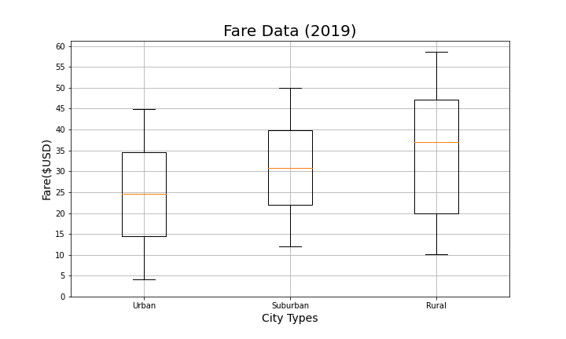
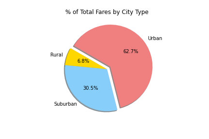
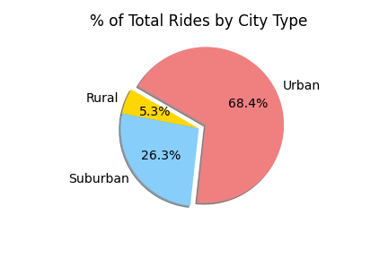
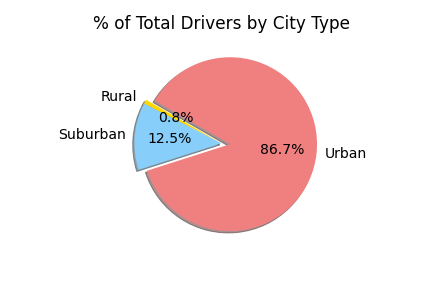
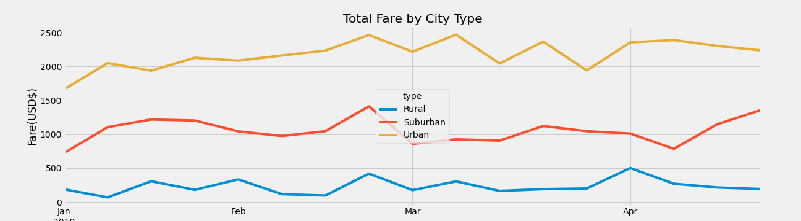

# PyBer_Analysis
Analysis of PyBer's ride sharing data from January through May 2019. 

# Overview of the analysis:

This project utilized Python, along with the packages Pandas, Matplotlib and NumPy, to analyze all ride sharing data for the company PyBer from January through May 2019. Differences in the data between three types of cities (urban, suburban and rural) have been summarized so that those differences can inform decision makers at PyBer.

# Results:

There is a description of the differences in ride-sharing data among the different city types. Ride-sharing data include the total rides, total drivers, total fares, average fare per ride and driver, and total fare by city type. (7 pt)

 

Included below is a bubble chart displaying the total number of rides and average fare per city in 2019. The data is color-coded to represent the three different city types: urban, suburban and rural, with the bubble sizes correlating with the number of drivers per city. As can be infered from the chart, urban cities trended toward having the greatest total number of rides in 2019 as well as the greatest number of drivers, followed by suburban and then rural city types. Conversely, rural cities trended toward having the most expensive average fare, followed by suburban and then urban city types. This is not surprising given that the trips in rural areas are most likely a longer distance than in urban or suburban areas, and the relatively higher rural pricing may also reflect an attempt to compensate for the fewer number of rides. 

The box-and-whiskers plots below display the same per-city data amalgamated by city type. The trends that were clear from viewing the bubble chart, including the increasing cost of ride fare from urban to suburban and rural city types, and the decreasing total number of drivers from urban to suburban and rural city types, are reaffirmed when viewing the medians of data in both plots below. 

| Ride Fare by City Type | Total Drivers by City Type |
:-------------------------:|:-------------------------:
  |   

Next we have three pie charts that display the percentages by city types accounting for total ride fare generated in 2019, the total number of rides in 2019 and the total number of drivers in 2019. 

| Total Fare in 2019 | Number of Rides in 2019 | Number of Drivers in 2019
:-------------:|:-------------:|:-----------:
 |  |  

Finally, the line graph below gives us a clear, high level picture of the total fares generated by each city type over the course of several months in 2019. Here the data becomes evident that despite the higher average ride fare in rural and suburban cities, urban city types consistently genererated the most total fare due to the higher total number of rides. 

# Summary:

There is a statement summarizing three business recommendations to the CEO for addressing any disparities among the city types.
1. Try out more drivers in rural areas. Its the city type with the fewest number of drivers and the highest average fare. If its the case that there are not currently enough drivers to meet the number of ride requests, then there is potential revenue being lost due to not investing enough resources into this city type. 
2. See if you can get away with less drivers in urban areas. While urban drivers accounted for 86.7% of total PyBer drivers in 2019, urban cities only accounted for 68.4% of the total PyBer rides during that same period. It may be the case that urban cities are saturated with more drivers than necessary for the number of requested rides, in which case the company could cut expenses by cutting or relocating unecessary drivers. 
3. 
4. (4 pt)
